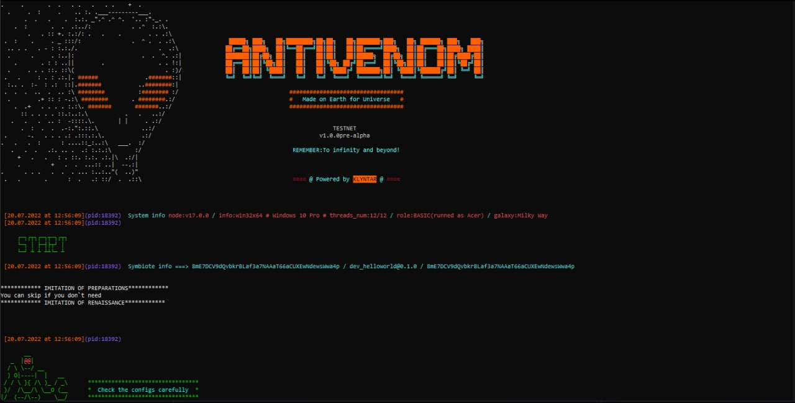

# Custom workflow template


Hello everyone! This this the "HelloWorld" workflow example. Follow changes here to understand how to write custom workflows and use them for KLYNTAR symbiotes

<br/><br/>

## <b>Requirements</b>

Although you're free in your ideas & inventions you should follow some rules, use global variables and so on

<br/>

Here is the list

<ul>

<li>File <code>configsTemplate.json</code></li>

Give the template of configuration for your workflow to allow other to customize and use own values


<b>Required configs options</b>

<ul>

<li><code>STOP_WORK</code></li>

true/false - if you want to stop your symbiote

<li><code>VERSION</code></li>

Workflow version

<li><code>SYMBIOTE_ID</code></li>

Identifier of symbiote.Usually,it's BLAKE3 hash of manifest

```js

let SYMBIOTE_ID = BLAKE3(MANIFEST)

```

<li><code>INFO</code></li>

Miscellaneous data like email, Telegram, site of symbiote. It might be controlled by DAO,some organization and so on. Might be empty({}). Has no format requirements - use everything you want

</ul>

<li><code>MANIFEST.WORKFLOW</code> and <code>MANIFEST.WORKFLOW_HASH</code></li>

These options are inside <code>MANIFEST</code> object used to load appropriate workflow and start the instance

</ul>

<br/>

<b>Required configs options as a single list</b>

```json

{
    "STOP_WORK":false,
    "VERSION":"13.3.7",
    "MANIFEST":{
        "WORKFLOW":"<YOUR_WORKFLOW>",
        "WORFLOW_HASH":"aaaaaaaaaaaaaaaaaaaaaaaaaaaaaaaaaaaaaaaaaaaaaaaaaaaaaaaaaaaaaaaa",//BLAKE3 hash
        ... //other options
    },
    "INFO":{
        "EMAIL":"example@example.com",
        ...
    }
}

```

<br/>

<li>Create file <code>routes.js</code> to define routes for node server</li>

Definitely your node should interact with other nodes / offchain services and so on. Also, you need to propose API, control routes and so on. In this file you tell the core how to load modules with your defined API. This file is on the top level of workflow directory hierarchy. Like this

```shell

KLY_Workflow
│
└───...(other workflows)
│     
└───dev_controller
│   └───routes   
│   │    └───main.js
│   │    └───server.js
│   │    └─... 
│   │
│   │───life.js
│   │───routes.js
│   └───verification.js
│
│
└───dev_controller
│   └───routes   
│   │    └───main.js
│   │    └───server.js
│   │    └─... 
│   │
│   │───life.js
│   │───routes.js
│   └───verification.js
│
...

```

This file has the following structure

```js

//Just import all needed modules with routes

['api.js','control.js','main.js','services.js'].forEach(
    
    mod => import(`./routes/${mod}`)
    
)


```

<li>Create file <code>life.js</code> and export function <code>RUN_SYMBIOTE</code></li>

<br/>

File <code>dev_helloworld/life.js</code>

```js

export let RUN_SYMBIOTE = () => {

    console.log('************ IMITATION OF PREPARATIONS************')
    console.log('You can skip if you don`t need')
    console.log('************ IMITATION OF RENAISSANCE************')

}

```

This funciton used on the top level of core in <code>klyn74r.js</code>


</ul>

<br/><br/>

## <b>How to test this workflow</b>

The same way as the others 😀

<br/>

1. Create separate dir
   
```bash

mkdir -p /some/path

export SYMBIOTE_DIR=/some/path

```

2. Let's try in testnet mode

```bash

export KLY_MODE=test

```
3. Copy the  the <code>CONFIGS</code> and <code>GENESIS</code> to <code>/some/path</code> and modify configs options you need

4. Run the symbiote. By default, it will output <code>"Hello World from dev_helloworld !!!"</code> every 3 seconds

5.Result



Log stream in console


And finally press <kbd>Ctrl+C</kbd> to terminate the instance
<br/>


<br/><br/>

## <b>Recomendations to write a good workflow</b>

<br/>

<ol>

<li>Follow best practises to make your workflow super powerfull</li>
<li>Make it maximum customizable - let other users set own values as many as possible</li>
<li>Test new workflow locally</li>
<li>Set handlers for system signals to safely stop the instance</li>
<li>Make it easy to use connectors</li>
<li>Try to make your workflow async as much as possible</li>

</ol>