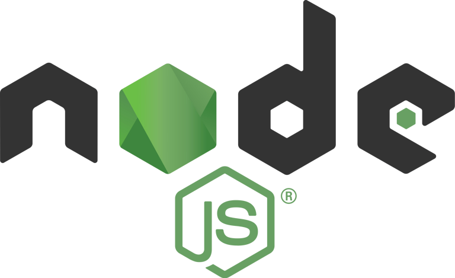
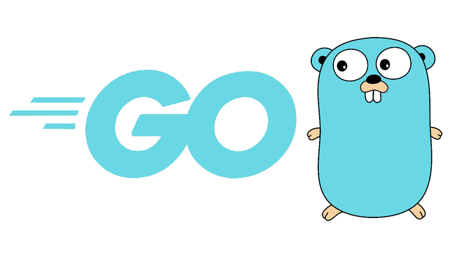
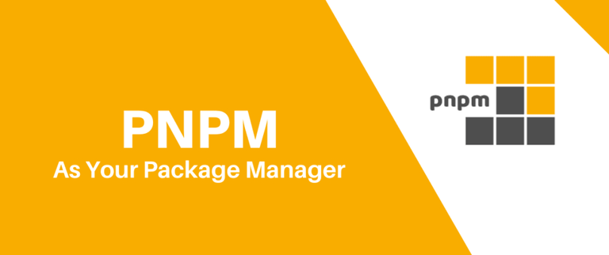

<div align="center">


#

</div>

<div align="center">

# <b>KLYNTAR</b> - a decentralized ecosystem of services for Web2 & Web3. Using a rich set of technologies and our knowledge, we are going to focus on solving a wide range of problems

</div>

Working on KLYNTAR, we've been trying to make a project so powerful to wonder you as in your 8 y.o. when you've got to know Santa doesn't exist 🎅. We want to resurrect the time of useful projects by creating cool stuff for our industry!

<br/>

# How to build


## Node.js installation

<div align="center">



</div>

Since the core is written on Node.js you should to install it. If you already have installed, we recommend checking the version. The recommended version is **v21.4.0**

**Linux:**

```bash
johndoe@klyntar:~$ node -v
v21.4.0
```
**Windows:**

```sh
C:\Users\JohnDoe>node -v
v21.4.0
```


## Go installation

<div align="center">



</div>

Some parts of KLY is written on Go(for example, PQC schemes), so you need to install it too. Or, check if you already have Go

```sh
go version
```

## PNPM install

<div align="center">



</div>

As a package manager for Node.js we use pnpm. To install it globally, run:

```sh
npm install -g pnpm
```

## After all

Now, clone the core repository

```sh
git clone https://github.com/KlyntarNetwork/KlyntarCore.git

cd KlyntarCore
```

### Install dependencies

```sh
pnpm install
```

### Link core to make it available from any location

```sh
npm link
```

### Build Golang addons

Now depending on your OS run the following commands:

**Linux:**

```bash
chmod 700 build_must_have_addons.sh

./build_must_have_addons.sh
```

**Windows:**

```sh
build_must_have_addons.bat
```

### Build KLY-EVM

**Linux:**

```sh
cd KLY_VirtualMachines/kly_evm

pnpm install

chmod 700 build_kly_evm.sh

./build_kly_evm.sh
```

**Windows:**

```sh
cd KLY_VirtualMachines\kly_evm

pnpm install

build_kly_evm.bat
```

### Return to main directory

```sh
cd ../../

// Set appropriate access (Linux only)
chmod 700 klyn74r.js
```

# Prepare configuration and genesis files

Now, you need 2 things to run your node and join some network:

1. Genesis file
2. Configuration for your node

To see how to setup it follow [here](https://docs.klyntar.org/deep-dive-into-kly/run-kly-node#prepare-configuration-and-genesis-files)


<div name="advice"></div>

## 🤓 <b>Advice</b>
<br/>
<p>
Follow us to get the news & updates ASAP. Discuss, share ideas, advices, help newbies to make our community more powerful.We're happy to involve new members to KLY community 😊
</p>

<br/>

<a href="https://www.reddit.com/r/KLYN74R/">  
  
</a>
<a href="https://twitter.com/KlyntarNetwork">
  
</a>
<a href="https://klyntar.medium.com/">
  
</a>
<a href="https://www.tiktok.com/@klyn74r">
  
</a>

<br/>

<a href="https://www.instagram.com/klyntarnetwork/">
  
</a>
  <a href="https://www.pinterest.com/klyn74r">
  
</a>
  <a href="https://dev.to/klyntar">
  
</a>
<a href="https://github.com/KlyntarNetwork">
  
</a>

<br/>

<a href="https://t.me/KlyntarNetwork">
  
</a>
<a href="https://discord.gg/f7e7fCp97r">
  
</a>
<a href="http://klyntar66kjwhyirucco6sjgyp2f7lfznelzgpjcp6oha2olzb4rlead.onion">
  
</a>
<a href="https://www.youtube.com/channel/UC3TiyK40an6rQlf3BarMDoQ">
  
</a>

<br/>

<a href="https://www.facebook.com/KLYN74R/">
  
</a>
<a href="https://gitlab.com/KLYNTAR">
  
</a>
<a href="https://klyn74r.tumblr.com/">
  
</a>
<a href="">
  
</a>

<br/><br/>


<div name="docs"></div>

## 📚<b>Docs</b>

Read the docs here to find out more. For example, how to use plugins, prepare & change configs, run on a host machine, how to start a KLY Service and so on!